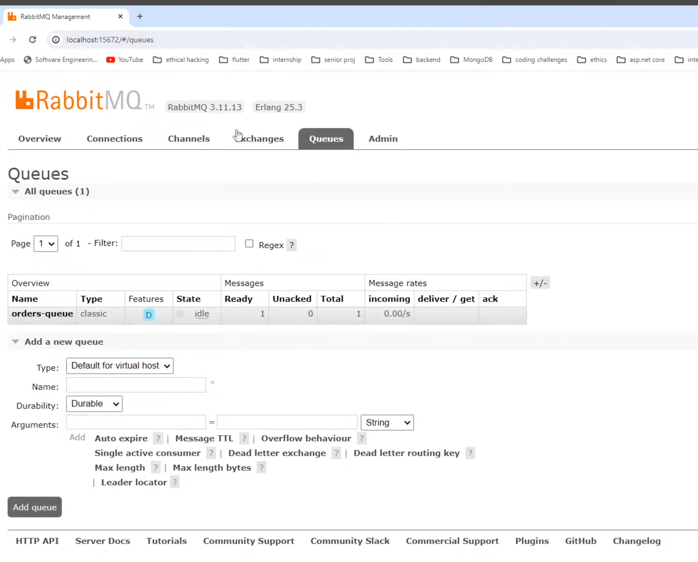

request reply pattern 

https://www.youtube.com/watch?v=JJrFm8IrYTQ&list=PLHVUNsO6sqSpeFjQBl1KZMYEI-IL5idqZ&index=15

in producer folder
run > npm i --save @nestjs/microservices@9
also run > npm i --save amqplib amqp-connection-manager

in consumer folder .. install the same packages 

⌛ 17:27
